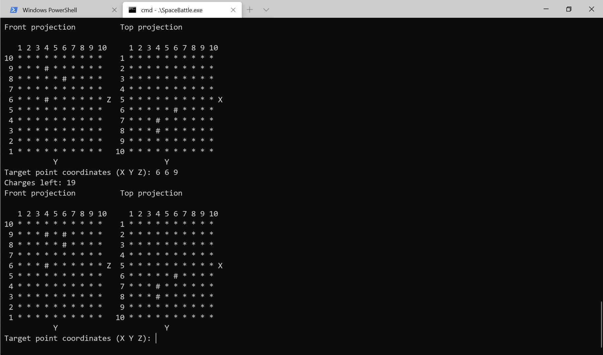

# SpaceBattle 

A simple CLI game. It is a variation of [Battleship game](https://en.wikipedia.org/wiki/Battleship_(game)) in 3D space. 

It has 3 levels. Was tested on Windows x86 and x64.  

Should work on Linux and Mac OS X as well. 

Gameplay example:  

 

### How To Build 
#### Prerequisites 

SpaceBattle can be built with CMake.  

First of all you will need a fresh CMake (3.15+). 

The game uses [Boost.Locale](https://www.boost.org/doc/libs/1_72_0/libs/locale/doc/html/building_boost_locale.html) and [Boost.Nowide](https://github.com/boostorg/nowide) libraries. 

You have to install Boost.Locale library yourself. 

To install Boost.Nowide you must clone repo with it's submodules: 

```Git 

$ git clone --recursive git@github.com:vocasle/SpaceBattle 

``` 

After that (sorry for that, I built Boost locally with [B2](https://boostorg.github.io/build/tutorial.html)) you must adjust 

`SpaceBattle/src/CMakeLists.txt` to point to `FindBoost.cmake` 

and adjust your Boost version like that: 

```CMake 

find_package(Boost 1.72.0 EXACT REQUIRED  

    COMPONENTS locale 

    HINTS "E:\\Libs\\boost_1_72_0\\stage\\lib\\cmake") 

``` 

If you are using [vcpkg](https://github.com/Microsoft/vcpkg) 
you can remove line `HINTS "E:\\Libs\\boost_1_72_0\\stage\\lib\\cmake"` 
and CMake should find your version of Boost.Locale. 

#### Build 

```CMake
$ cd SpaceBattle
$ mkdir build
$ cmake -S . -B build
$ cmake --build build
```

You can install SpaceBattle as well
```CMake
$ cmake --install . # CMake 3.15+ only
```